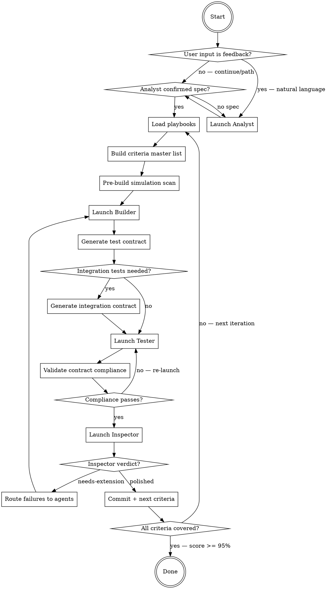

# Autocraft

Five agents. Strict roles. No self-grading. Human in the loop.

```
Human ◄──► Analyst (foreground agent)
               │
               ├──► spec.md (writes/updates)
               ├──► .autocraft/feedback-log.md (routes feedback)
               │
               ▼
           Orchestrator (you) ──► Builder (background agent)
                              ──► Tester (background agent)
                              ──► Inspector (foreground agent)
```

The **Analyst** talks to the human, collects feedback, writes and updates spec.md, and routes actionable feedback to the right agent. → [analyst.md](analyst.md)
The **Builder** implements features but CANNOT write tests, review its own work, grade itself, or commit. → [builder.md](builder.md)
The **Tester** writes journey tests but CANNOT modify production code. They only read it to understand what to test. → [tester.md](tester.md)
The **Inspector** verifies output with automated scans and subjective review. Only the Inspector can set "polished." → [inspector.md](inspector.md)
The **Orchestrator** manages handoffs and commits only when the Inspector approves. → below

**Why this separation matters:** A builder who writes their own tests optimizes for tests that pass — not for tests that prove features work. In UI projects, they know the button is wired up, so they assert it exists and move on. In integration projects, they know the function returns data, so they assert non-nil and move on. A separate tester doesn't know the internals. They read the contract, exercise the pipeline, and check what came out. If the output is wrong, they write a failing test — and the builder has to make it pass.

---

## When to Use

- Building a new app or feature set from a spec with multiple acceptance criteria
- You want automated, verified proof that every criterion is met (screenshots for UI projects, test results for integration-only projects)
- The project needs real implementations (not stubs) with independent test verification
- Consolidating or refactoring tests into scenario-based integration tests
- Building or testing CLI tools, libraries, or APIs where data pipeline correctness matters
- You have a `spec.md` (or gist) describing requirements and acceptance criteria

## When NOT to Use

- **Single-file bug fixes** — just fix the bug directly, autocraft is overkill
- **Quick prototyping** where stubs are acceptable — autocraft enforces real implementations
- **No spec yet and you're not ready to write one** — start with the Analyst step or write spec.md first

## Project Mode

The Orchestrator detects the project mode at startup and records it in `.autocraft/journey-loop-state.md`:

| Mode | When | UI test contract | Integration test contract | Screenshots |
|------|------|-----------------|--------------------------|-------------|
| `ui` | Project has a UI framework AND spec describes user-visible behavior | Yes | Optional (when silent failure risks detected) | Required |
| `integration` | No UI, or spec describes data pipelines, APIs, test refactoring, or library behavior | No | Yes (primary contract) | Not required |

**Detection rules (in order):**
1. If `spec.md` contains `mode: integration` or `mode: ui` in frontmatter → use that
2. If the task is test refactoring (spec describes reorganizing, consolidating, or improving tests) → `integration`
3. If the project has no UI framework and no UI test target → `integration`
4. Otherwise → `ui`

**What changes in `integration` mode:**
- Step 5 (Builder): **skipped entirely** if no production code changes are needed (e.g., pure test refactoring)
- Step 6 (UI test contract): **skipped**
- Step 7 (integration test contract): **always generated** — this is the primary contract
- Step 8 (Tester): Timing Watcher is **skipped** (no screenshots to time)
- Step 9 (contract compliance): validates integration contract only
- Step 10 (Inspector): **skips screenshot review**, focuses on objective scans + test quality + assertion honesty
- Step 12 (pre-stop audit): checks test step exists + passes (no screenshot requirement)

---

## Inputs

**Special command:** If `$ARGUMENTS` is `init`, run the init flow instead of the build loop:

1. Copy `{skill-base-dir}/claude-md-template.md` to `CLAUDE.md` in the user's project root
2. Create `.autocraft/` directory if it doesn't exist
3. Tell the user: "Analyst is now always-on in this project. Just talk naturally — I'll handle specs, feedback routing, and build triggers automatically."
4. **Do not start the build loop.** Return immediately.

If `CLAUDE.md` already exists, append the Analyst section under a `# Autocraft Analyst` heading instead of overwriting.

---

Spec source: $ARGUMENTS (defaults to `spec.md` in current directory)

**Gist support:** If `$ARGUMENTS` is a GitHub gist URL or gist ID, the spec lives in the gist instead of a local file.

**Detection rules:**
- Starts with `https://gist.github.com/` → gist URL. Extract gist ID from the last path segment.
- Matches `/^[a-f0-9]{20,}$/` → bare gist ID.
- Otherwise → local file path.

```bash
# Read spec from gist
gh gist view <gist-id> -f spec.md

# Update spec in gist (Analyst only) — non-interactive
gh api --method PATCH /gists/<gist-id> \
  -f "files[spec.md][content]=$(cat /tmp/spec-updated.md)"

# If gist has no file named spec.md, list files first:
gh gist view <gist-id> --files
```

**Error handling:** If `gh gist view` fails, print the error, ask the user to verify the gist URL and run `gh auth status`, and do not proceed until the spec is readable.

The Orchestrator detects the source type at startup and stores it in `.autocraft/journey-loop-state.md` as `Spec source: gist:<gist-id>` or `Spec source: file:<path>`. All agents read the spec through a consistent method — the Orchestrator fetches the latest content and includes it in each agent's prompt. The Analyst writes spec updates to a temp file then pushes via `gh api`.

---

## Shared State Files

| File | Written by | Read by |
|------|-----------|---------|
| `.autocraft/journeys/*/` | Builder (code), Tester (tests+screenshots) | Inspector, Orchestrator |
| `.autocraft/journeys/*/test-contract.md` | **Orchestrator** | **Tester** (implements it), Inspector (validates against it) |
| `.autocraft/journeys/*/integration-test-contract.md` | **Orchestrator** | **Tester** (implements unit tests), Inspector (validates) |
| `.autocraft/journeys/*/screenshot-timing.jsonl` | Tester (snap helper) | Orchestrator (watcher) |
| `.autocraft/journey-state.md` | Tester (`needs-review`), Inspector (`polished`/`needs-extension`) | All |
| `.autocraft/journey-refinement-log.md` | Inspector | Orchestrator |
| `.autocraft/journey-loop-state.md` | Orchestrator | Orchestrator (resume) |
| `AGENTS.md` (repo root) | Inspector | Builder, Tester (each restart) |
| `.autocraft/feedback-log.md` | Analyst | Orchestrator, Builder, Tester, Inspector |

---

## Playbooks

Playbooks are shared, platform-specific knowledge bases stored as GitHub gists. Agents load the relevant playbook(s) at the start of every iteration.

Default registry gist: `bca7073d567ca8b7ba79ff4bad5fb2c5`. Override via `.autocraft` file at repo root. See [playbooks.md](playbooks.md) for full registry management, CRUD commands, entry format, and auto-fork behavior.

---

# Orchestrator Protocol (this agent)

You are the skeptical project manager. You don't write code. You don't review screenshots. You manage handoffs and ensure neither the Builder, Tester, nor Inspector cuts corners. You commit ONLY when the Inspector approves.

**Analyst integration — MANDATORY:** Every invocation where `$ARGUMENTS` contains natural language (not a file path or "continue") MUST launch the Analyst FIRST. The Analyst logs feedback to `.autocraft/feedback-log.md` and optionally updates `spec.md`. The Orchestrator MUST NOT skip the Analyst and go directly to the Builder when the user provides feedback. During the loop, check `.autocraft/feedback-log.md` at every handoff point for new entries. Route feedback items to the appropriate agent as part of their next launch directive.



## Step 1: Detect User Intent and Launch Analyst

**This step runs EVERY invocation, not just the first.** The Orchestrator must classify the user's `$ARGUMENTS` before doing anything else:

| `$ARGUMENTS` pattern | Intent | Action |
|---------------------|--------|--------|
| Empty, `continue`, or a file/gist path | Resume build loop | Skip Analyst if spec exists |
| Natural language describing problems, bugs, or desired changes | **Feedback** | **Launch Analyst** to classify, log to `.autocraft/feedback-log.md`, and optionally update `spec.md` |
| Natural language describing new features or requirements | **New requirement** | **Launch Analyst** to update `spec.md` and log to `.autocraft/feedback-log.md` |

**Detection heuristic:** If `$ARGUMENTS` is NOT one of [`continue`, a file path, a gist URL, a bare gist ID, or empty], treat it as human feedback and launch the Analyst.

### When Analyst is needed:
1. Launch the **Analyst** (foreground) with [analyst.md](analyst.md) contents and the human's message
2. The Analyst classifies the feedback, writes to `.autocraft/feedback-log.md`, and optionally updates `spec.md`
3. After the Analyst completes, the Orchestrator reads `.autocraft/feedback-log.md` for routed items and proceeds to Step 2

### When Analyst is NOT needed:
- `$ARGUMENTS` is `continue` or a spec path AND `spec.md` exists → skip directly to Step 2
- But STILL check `.autocraft/feedback-log.md` for unresolved items at every handoff point

### Spec updates
Only the Analyst can modify `spec.md`. When user feedback implies a spec change (new requirement, changed behavior, removed feature), the Analyst updates the spec AND logs to `.autocraft/feedback-log.md`. The Orchestrator re-reads the spec in Step 3 to pick up changes.

## Step 2: Sync Playbooks (cached)

Playbooks are cached locally in `.autocraft/` to avoid re-fetching unchanged content every iteration.

### File layout

```
.autocraft/
├── playbook-rules.md          # Auto-generated: all pitfall/rule entries (NEVER hand-edit)
├── role-builder.md             # Auto-generated: role-specific for Builder
├── role-tester.md              # Auto-generated: role-specific for Tester
├── role-inspector.md           # Auto-generated: role-specific for Inspector
├── role-orchestrator.md        # Auto-generated: role-specific for Orchestrator
└── templates/                  # Auto-generated: template files
    └── journey-test-case.md
```

`AGENTS.md` (repo root) is **user-editable** — project-specific rules, conventions, notes. It should reference the playbook cache:

```markdown
# AGENTS.md

{user's project-specific rules here}

## Platform Rules
Read and follow all rules in [.autocraft/playbook-rules.md](.autocraft/playbook-rules.md).
```

### Sync protocol

1. Resolve the registry gist ID: read `.autocraft` from repo root if it exists, otherwise use default `bca7073d567ca8b7ba79ff4bad5fb2c5`.
2. Fetch the registry to get playbook gist IDs.
3. For each playbook gist, check if the local cache is current:

```bash
REMOTE_TS=$(gh api /gists/<gist-id> --jq '.updated_at')
LOCAL_TS=$(head -1 .autocraft/playbook-rules.md 2>/dev/null | grep -oP '(?<=playbook_updated: ).*' || echo "")

if [ "$REMOTE_TS" = "$LOCAL_TS" ]; then
  echo "Cache is current — skip full fetch"
else
  echo "Playbook changed — re-fetch and rebuild cache"
fi
```

4. **If timestamps match:** read cached files locally. No network calls.
5. **If timestamps differ (or cache missing):** do the full fetch, then rebuild the cache (see below).

### Full fetch & rebuild cache (only when stale)

Fetch ALL files from the playbook gist. Sort them into the cache:

| Prefix/pattern | Cache location |
|---------------|---------------|
| No prefix (pitfalls, guides, rules) | `.autocraft/playbook-rules.md` (concatenated, timestamped) |
| `role-{agent}-*` | `.autocraft/role-{agent}.md` |
| `template-*` | `.autocraft/templates/{name}.md` |

Write `.autocraft/playbook-rules.md`:

```markdown
<!-- playbook_updated: 2026-03-30T12:19:55Z -->
# Platform Rules — Auto-generated from playbooks. Do not edit.

---
{concatenate all pitfall/guide/rule entries here, each as a section with --- separators}
```

### Ensuring AGENTS.md references the cache

If `AGENTS.md` exists but does NOT contain a reference to `.autocraft/playbook-rules.md`, append:

```markdown

## Platform Rules
Read and follow all rules in [.autocraft/playbook-rules.md](.autocraft/playbook-rules.md).
```

If `AGENTS.md` does not exist, create it with a minimal scaffold:

```markdown
# AGENTS.md

## Platform Rules
Read and follow all rules in [.autocraft/playbook-rules.md](.autocraft/playbook-rules.md).
```

The user can then add project-specific rules above or below the reference.

### Why this design

- **AGENTS.md stays user-editable** — the Orchestrator never overwrites user content
- **Playbook rules are cached locally** — one API call to check freshness, full fetch only when stale
- **`AGENTS.md` is loaded by the harness** into every agent's context. The reference directive ensures agents also read the playbook rules file.
- **Adding a new playbook entry** = update the gist → next run detects the timestamp change → cache rebuilds → all agents see it

## Step 3: Build Acceptance Criteria Master List

Read the spec in full (local file or `gh gist view <gist-id> -f spec.md`). For every requirement, extract EVERY acceptance criterion. Write to `.autocraft/journey-loop-state.md`:

```markdown
# Journey Loop State

**Spec:** <path>
**Started:** <timestamp>
**Current Iteration:** 1
**Status:** running

## Acceptance Criteria Master List
Total requirements: N
Total acceptance criteria: M

| ID | Requirement | Criterion # | Criterion Text |
|----|-------------|-------------|----------------|
```

Read `.autocraft/journey-state.md` to determine what to work on:
1. Check `.autocraft/feedback-log.md` for **blocking** items — address these first
2. Any `in-progress` or `needs-extension` → work on that next
3. Check `.autocraft/feedback-log.md` for **important** items — incorporate into next agent launch
4. If none, pick next uncovered spec requirement

## Step 4: Pre-Build Simulation Scan

Before launching the Builder, scan for simulation infrastructure that bypasses real code paths. The playbook provides platform-specific scan commands (`role-orchestrator-{platform}.md`).

If any scan is not CLEAN: include in Builder's directive as **first priority to fix**.

## Step 5: Launch Builder Agent (background)

**Integration mode — Builder skip:** If the project mode is `integration` AND no production code changes are needed (e.g., pure test refactoring, test consolidation), skip this step entirely and proceed to Step 7. Record in `.autocraft/journey-loop-state.md`: `Builder: skipped (no production code changes needed)`.

Spawn a background Agent with:
1. [builder.md](builder.md) contents
2. Directive to read `AGENTS.md` and `.autocraft/playbook-rules.md` (agents read these files themselves — the harness auto-loads `AGENTS.md`, and the agent reads `.autocraft/playbook-rules.md` per Step 0)
3. `.autocraft/role-builder.md` content (role-specific playbook, cached locally)
4. Current `.autocraft/journey-state.md`
5. Directive: which journey to build/extend, plus any simulation fixes from Step 4
6. Any **Builder-routed feedback** from `.autocraft/feedback-log.md` (unresolved items where `Routed to: Builder`)

The Builder implements production features and creates the journey directory, but does NOT write test files.

Wait for Builder to complete.

### Post-Builder Gate: AGENTS.md Compliance Check

After the Builder completes, verify it followed the rules in `AGENTS.md`. Run the platform-specific scan commands from the playbook (`role-orchestrator-{platform}.md`) plus these general checks:

1. **Generated project files** — if a project generator config exists (e.g., `project.yml`), check `git diff --name-only` for direct edits to generated files (e.g., `.pbxproj`). Violation = re-launch Builder.
2. **Simulation infrastructure** — re-run the pre-build simulation scan. Any new violations = re-launch Builder.
3. **Any other AGENTS.md rule violations** — read the diff, compare against AGENTS.md rules.

If ANY violation: **re-launch the Builder** with the specific violation and directive to read `AGENTS.md` and fix it.

## Step 6: Generate UI Test Contract (UI mode only)

**Skip this step in `integration` mode** — proceed directly to Step 7.

**This is the critical structural step.** The Orchestrator — not the Tester — defines what the test must prove. The Tester only implements it.

Using the spec's acceptance criteria AND the Builder's testability contract, generate a **test contract** and write it to `.autocraft/journeys/{NNN}-{name}/test-contract.md`:

```markdown
# Test Contract: Journey {NNN}

## State Machine
<!-- Order matters. Later phases depend on states established by earlier phases. -->
Phase 1: [initial state]
Phase 2: [state after action X] — depends on Phase 1
Phase 3: [state after action Y] — depends on Phase 2
...

## Criteria

### AC{N}: {criterion text from spec}
- PREREQUISITE: {state the app must be in — reference the Phase that establishes it}
- ACTION: {exact UI action — e.g., "click quickAction_Summarize"}
- ASSERT: {exact observable result — e.g., "terminalOutputArea contains 'Summarize'"}
- ASSERT_CONTAINS: {specific content that PROVES the action completed — e.g., "multi-line output", "contains 'Summary:'". NEVER just "changed" or "not empty"}
- ASSERT_TYPE: behavioral | state | existence
  <!-- behavioral = action produces the EXPECTED result (REQUIRED for action-verbs like "sends", "opens", "seeks")
       state = element property matches expected value (OK for "disabled when X")
       existence = element is present (ONLY OK for "visible" criteria) -->
- SCREENSHOT: {name}
- FAIL_IF_BLOCKED: "FAIL('Cannot test AC{N}: {prerequisite} not met — {what went wrong}')"
  <!-- The playbook maps FAIL to the platform's assertion failure macro (e.g., XCTFail for macOS/XCUITest) -->
```

**Rules for writing the contract:**
1. If the criterion's verb describes an **action** ("sends", "opens", "auto-cds", "seeks"), the ASSERT_TYPE MUST be `behavioral` — the test must verify an observable change, not just element existence
2. Every criterion with a prerequisite must reference the Phase that establishes it. If that Phase fails, the test must FAIL with the FAIL_IF_BLOCKED message
3. The Orchestrator must think adversarially: "If the Builder left the handler empty but kept the UI element, would this assertion catch it?" If not, strengthen the assertion.
4. Every `behavioral` criterion MUST have an ASSERT_CONTAINS that would FAIL if the action produced an error, a prompt, or any unintended intermediate state instead of the expected result. "Output changed" or "output is not empty" are NEVER sufficient for ASSERT_CONTAINS.

## Step 7: Generate Integration Test Contract & Refactor if Needed

**In `integration` mode:** This step is ALWAYS executed — the integration test contract is the primary (and only) test contract. Analyze existing code and tests to generate scenario-based integration test contracts.

**In `ui` mode:** This step is conditional. After the Builder completes, the Orchestrator analyzes the new/modified code to decide if integration-level tests are needed in addition to UI tests. Not every journey needs them — UI tests cover user-visible behavior; integration tests cover "does the plumbing actually work."

### When to generate integration tests

**In `integration` mode:** Always. Scan the existing code to identify all testable pipelines.

**In `ui` mode:** Scan the Builder's code for **silent failure risks** — things that break without UI tests catching it:

- **External dependency** — C/FFI, vendored libs, model loading: links at build time but may crash/nil at runtime
- **Data pipeline with file I/O** — output file exists but contains garbage (wrong format, corrupted)
- **Multi-stage handoff** — A→B→C where the handoff silently drops data
- **Format conversion** — resampling, encoding, serialization where content is wrong but file looks valid

If none of these patterns are present (pure UI, layout, cosmetic), skip this step in `ui` mode.

### Analysis process

1. **Read the Builder's new/modified files** in the Data and Domain layers
2. **Identify integration boundaries** — where does data cross between components? What could silently fail?
3. **Ask: "If I empty this function's body, would the UI test still pass?"** If yes → needs an integration test
4. **Check testability** — can the component be instantiated and called without launching the full app? If not, the Builder must **refactor** it to be testable (extract logic from UI, inject dependencies)

### Refactoring directive (when needed)

If a component can't be tested in isolation (e.g., business logic is tangled with UI, or a service is a singleton with no injection point), the Orchestrator sends the Builder back with a **refactoring directive**:

> "Refactor {Component} so it can be instantiated in a unit test without launching the app. Extract the core logic into a testable function/class that takes explicit inputs and returns explicit outputs."

The Builder refactors, the Orchestrator re-analyzes, then generates the test contract.

**Loop limit:** If after 2 refactoring attempts the component is still not testable in isolation, skip integration tests for this journey and note the gap in `.autocraft/journey-refinement-log.md`.

### Integration test contract

Write to `.autocraft/journeys/{NNN}-{name}/integration-test-contract.md`:

```markdown
# Integration Test Contract: Journey {NNN}

## Analysis
<!-- What was found in the code that needs integration testing -->
- Pipeline: {A → B → C → D}
- Silent failure risk: {what could break without UI tests catching it}
- Files involved: {list of source files}

## Integrated Scenario Tests

### SCENARIO{N}: {full pipeline being verified}
- PIPELINE: {A → B → C → D — describe the full data flow}
- STEPS:
  1. SETUP: {create real test data — temp dirs, generate audio via `say`, etc.}
     ASSERT: {setup produced valid data}
     FAIL: "Step 1: {what went wrong}"
  2. ACTION: {Component A processes input}
     ASSERT: {A produced expected output — check content, not just existence}
     FAIL: "Step 2: {specific failure}"
  3. ACTION: {Component B receives A's output}
     ASSERT: {B produced expected output}
     FAIL: "Step 3: {specific failure}"
  4. VERIFY: {end-to-end output matches expectations}
     ASSERT: {final result is correct — parse, validate content}
     FAIL: "Step 4: {specific failure}"

## Edge Case Tests (only for paths NOT covered by scenarios)
### EDGE{N}: {error condition or boundary}
- SCOPE: {specific edge case}
- ASSERT: {expected behavior}
```

**Rules:**
1. **Integrated scenario tests, not unit tests.** One test per pipeline that exercises the full chain A → B → C → D. A single scenario test replaces 4 isolated unit tests.
2. **Step-by-step assertions with unique failure messages.** Each step asserts before the next step begins. Fail messages say exactly which step and what went wrong. The AI reads the failure and knows immediately where to look.
3. **Fail fast.** If Step 2 fails, Steps 3-4 don't run. Use `guard` + assertion.
4. Use real dependencies (real files, real libraries) — mocks hide the exact bugs these tests are meant to catch
5. Tests must be runnable without launching the app — use the platform's test-visibility mechanism to access internals (see playbook) and instantiate components directly
6. Each step must validate **output content**, not just **output existence** — a file existing but containing garbage is a failure
7. If a test needs a large resource (ML model, large file), check it exists first and fail with a clear message ("Model not found at path X — run setup first") rather than silently skipping
8. **Remove redundant small tests.** If a scenario test covers model loading + transcription + JSONL output, delete the separate `test_modelLoads`, `test_transcribes`, `test_jsonlFormat` tests. Only keep small tests for edge cases NOT exercised by any scenario.
9. **Never skip tests.** Every test runs every time. Slow tests are acceptable — they're proving real functionality.

## Step 8: Launch Tester Agent (background)

After the test contracts are written, spawn a background Tester Agent with:
1. [tester.md](tester.md) contents
2. Directive to read `AGENTS.md` and `.autocraft/playbook-rules.md` (same as Builder — harness auto-loads `AGENTS.md`, agent reads playbook rules per Step 0)
3. `.autocraft/role-tester.md` content (role-specific playbook, cached locally)
4. The spec file path
5. **The UI test contract** (`.autocraft/journeys/{NNN}-{name}/test-contract.md`)
6. **The integration test contract** (`.autocraft/journeys/{NNN}-{name}/integration-test-contract.md`) if it exists
7. The Builder's report (accessibility identifiers, testability notes, integration boundaries)
8. Directive: implement and run integration tests first, then UI tests
9. If this is a re-launch after rejection: include the specific failure list with line numbers
10. Any **Tester-routed feedback** from `.autocraft/feedback-log.md` (unresolved items where `Routed to: Tester`)

**Timing Watcher (UI mode only)** — in `integration` mode, skip the watcher entirely. In `ui` mode, poll `screenshot-timing.jsonl` every 5s, kill test on unexcused SLOW entries:

```bash
TIMING_FILE=".autocraft/journeys/{NNN}-{name}/screenshot-timing.jsonl"
SEEN=0
while true; do
  if [ -f "$TIMING_FILE" ]; then
    TOTAL=$(wc -l < "$TIMING_FILE" | tr -d ' ')
    if [ "$TOTAL" -gt "$SEEN" ]; then
      tail -n +"$((SEEN + 1))" "$TIMING_FILE"
      SLOW_COUNT=$(tail -n +"$((SEEN + 1))" "$TIMING_FILE" | grep '"SLOW"' | grep -cv 'SLOW-OK' || true)
      SEEN=$TOTAL
      if [ "$SLOW_COUNT" -gt "0" ]; then
        echo "VIOLATION: $SLOW_COUNT SLOW entries"
        # Kill test process — platform-specific command from playbook (role-orchestrator-{platform}.md)
        exit 1
      fi
    fi
  fi
  sleep 5
done
```

Wait for Tester to complete.

### Post-Tester Gate: AGENTS.md Compliance Check

Same checks as Post-Builder Gate. If ANY AGENTS.md rule violation: **re-launch the Tester** with the specific violation.

## Step 9: Validate Contract Compliance (structural — before Inspector)

After the Tester finishes, validate the test file against the test contract. This is a **mechanical check** — not subjective review.

For each criterion in the contract:
1. **ACTION present?** — grep the test file for the action target (e.g., the element being clicked). If the contract specifies an action and the test file doesn't contain the corresponding interaction → FAIL
2. **ASSERT present?** — grep for the assertion. If the contract says `ASSERT_TYPE: behavioral` and the test only checks existence → FAIL
3. **No silent skips?** — grep for conditional guards that wrap contract assertions. Any match = the Tester made a mandatory assertion optional → FAIL
4. **FAIL_IF_BLOCKED present?** — for criteria with prerequisites, grep for the FAIL message from the contract. If missing, the Tester will silently skip blocked criteria → FAIL
5. **ASSERT_CONTAINS enforced?** — for every `behavioral` criterion, grep the test file for a content-matching assertion near the action. If the test only detects change without verifying expected content → FAIL

The playbook provides the platform-specific grep patterns and test file path conventions (`role-orchestrator-{platform}.md`). The Orchestrator constructs these checks dynamically from the contract.

If ANY check fails: **re-launch the Tester immediately** with the specific violations. Do NOT proceed to Inspector.

## Step 10: Launch Inspector Agent (foreground)

After Tester finishes, spawn an Inspector Agent with:
1. [inspector.md](inspector.md) contents
2. The spec file path
3. Directive: evaluate the most recent journey
4. **Project mode** — tell the Inspector whether this is `ui` or `integration` mode
5. In `ui` mode: if the `/frontend-design` skill is installed, invoke it and include its output for design principles during screenshot review
6. In `integration` mode: tell the Inspector to skip screenshot review and focus on objective scans, test quality, and assertion honesty

Wait for Inspector verdict.

## Step 11: Act on Inspector's Verdict

**If Inspector set `polished`:**
1. Commit all changes (journey files, screenshots, app code, updated journey-state.md)
2. Update `.autocraft/journey-loop-state.md` with iteration results
3. Move to next uncovered criteria

**If Inspector set `needs-extension`:**
1. Read Inspector's specific failure list from `.autocraft/journey-refinement-log.md`
2. DO NOT commit
3. Route each failure to the right agent:
   - Production code issue (feature doesn't work, stub, missing implementation) → re-launch **Builder**
   - Test issue (existence-only assertion, missing interaction, wrong verification) → **update the test contract** to strengthen the failing assertions, then re-launch **Tester** with the updated contract + Inspector's failure list
   - Both → re-launch Builder first, then update contract + re-launch Tester
   - Visual/UX issue (garbled rendering, incomplete flow, broken layout visible in screenshots — `ui` mode only) → re-launch **Builder** with the specific screenshot and failure description. The Builder must fix the root cause (e.g., use a proper rendering library, pre-configure interactive tools, handle prompts automatically).
4. When updating the contract after Inspector rejection:
   - For each failed criterion, tighten the ASSERT to make the failure structurally impossible (e.g., if the Tester used `.exists` where the contract said `behavioral`, add an explicit example assertion to the contract)
   - Add any missing FAIL_IF_BLOCKED messages the Inspector identified
5. Go back to Step 5 (or Step 6/8 depending on failure type)

## Step 12: Pre-Stop Audit (when score >= 90% or all journeys polished)

1. Read the Acceptance Criteria Master List (M rows)
2. For each criterion: confirm journey maps it + test step exists + (`ui` mode: screenshot exists, `integration` mode: test passes)
3. Build audit table with VERDICT column
4. If uncovered > 0: do NOT stop. Re-launch Builder (or Tester in `integration` mode) for gaps.
5. Stop ONLY when: score >= 95% AND 0 uncovered AND all journeys `polished` by Inspector

## Stop Condition

ALL of:
- Inspector score >= 95%
- All journeys set to `polished` by Inspector (not by Builder)
- Pre-stop audit: 0 uncovered criteria
- All objective scans pass (no bypass flags, no stubs, no empty artifacts)
- `ui` mode: all criteria have screenshot evidence
- `integration` mode: all integration tests pass with behavioral assertions

---

# Templates

The playbook provides the platform-specific test base class template (`template-journey-test-case.md`). Copy it into the test target if not already present. It provides:
- Screenshot capture with dedup and timing
- Setup/teardown lifecycle
- Timing log for the Orchestrator's watcher

Usage patterns and code examples are documented in the playbook template entry.

---

# Common Mistakes

| Mistake | Fix |
|---------|-----|
| Builder keeps getting re-launched because test contract assertions are too strict for the current implementation stage | Orchestrator should write contracts that match what's actually testable now, then tighten in later iterations |
| Inspector rejects because screenshots show permission dialogs (UI mode) | Run `/preflight-permissions` first to grant all TCC permissions |
| Tester writes existence-only assertions (`.exists`) for behavioral criteria | Orchestrator's contract compliance check (Step 9) should catch this before Inspector — if it doesn't, tighten the contract |
| Builder and Tester both try to modify the same file | Enforce role separation — Builder writes production code, Tester writes test code only |
| Loop stalls with no progress for multiple iterations | Check stall detection — if Builder/Tester produce no changes for 2 iterations, re-launch with Inspector's last failure list |
| Playbook gist update fails with 403/404 | Auto-fork triggers automatically — see [playbooks.md](playbooks.md) |

---

# Real-Time Feedback During Builds & Tests

Long-running commands (builds, test suites, deploys) MUST produce visible progress. Silent waits kill iteration speed — the human (or Orchestrator) can't react to errors they can't see.

## The Problem

AI agents commonly suppress build/test output to save context window space (via `tail`, `grep`, `| head`, or `run_in_background`). This creates a false economy:
- A 60-second silent wait hides a 5-second failure that could have been fixed immediately
- Piped commands (`cmd | grep pattern`) buffer output — nothing appears until the command exits
- Background tasks with polling add latency and complexity for no benefit when the task is blocking anyway

## Rules for All Agents

1. **Never pipe running process output through filters.** Run build/test commands directly. Let output stream. (Grepping static files for scanning is fine — this rule applies to long-running commands.)
2. **Never use `tail -N` on long commands.** It waits for completion before showing anything.
3. **Split multi-step scripts into individual commands** when you need to see each step's result. Don't run a monolithic script that builds + seeds + tests in one invocation — run each phase separately so failures are visible immediately.
4. **When a command produces too much output** (e.g., npm install with 500 lines), accept the output cost. A bloated context is better than a missed error. If context pressure is a real concern, delegate the command to a **sub-agent** — the sub-agent's context absorbs the verbose output, and only the result (pass/fail + error) returns to the parent.
5. **React to errors immediately.** If a test fails at second 5 of a 60-second suite, don't wait for the suite to finish. Read the error, fix it, re-run.
6. **Use sub-agents for isolation, not for hiding.** The right pattern:
   - Parent agent: coordinates, tracks progress, stays lean
   - Sub-agent: runs the noisy build/test, absorbs verbose output, returns a concise result
   - This gives the parent real-time awareness (via the sub-agent's return) without context pollution

## Pattern: Build-Test-Fix with Sub-Agents

When iterating on code + tests:

```
Builder or Tester (lean context):
  1. Make code changes
  2. Spawn sub-agent: "Build and run test X. Return: pass/fail, error message if failed, screenshot paths"
  3. Sub-agent runs commands with full streaming output (in its own context)
  4. Sub-agent returns: "FAIL: headerCount expected 2 got 3, line 113"
  5. Builder/Tester reads error, fixes code, spawns sub-agent again
```

This is strictly better than:
- `cmd 2>&1 | tail -5` → hides the error, waits for completion
- `cmd 2>&1 | grep ERROR` → buffers output, misses context around the error
- Running in background + polling → adds latency, complex coordination

## Anti-Patterns

| Anti-pattern | Problem | Fix |
|---|---|---|
| `./build-and-test.sh \| tail -20` | Waits for full completion, hides early errors | Run each step separately, or use sub-agent |
| `./test.sh \| grep -E "pass\|fail"` | Pipe buffers, no output until exit | Run directly, or use sub-agent |
| `run_in_background` + sleep + poll | Adds 5-30s latency per poll cycle | Run in foreground, or use sub-agent |
| Timeout of 120s on a command that fails at 3s | Waits 120s for nothing | Use shorter timeout + sub-agent |

---

# Safety & Limits

- **No iteration limit.** Loop runs until user stops or stop condition met.
- **Stall detection:** If Builder or Tester produces no changes for 2 consecutive iterations, log and re-launch with Inspector's last failure list.
- **Only the Analyst can modify the spec** (local `spec.md` or gist) — read-only for all other agents. The Analyst must confirm changes with the human before writing.
- **`.autocraft/feedback-log.md` is append-only** — entries are never deleted, only marked resolved.
- **Playbook gists are append-only.** New entries can be added; existing entries should not be deleted.
- Recurring tasks auto-expire after 7 days if run via `/loop`.

---

# Optional External Skills

These skills enhance autocraft but are not required. If not installed, autocraft works without them.

| Skill | Used by | Purpose |
|-------|---------|---------|
| `/frontend-design` | Inspector (via Orchestrator) | Design principles for screenshot review. If missing, Inspector uses general design judgment. |
| `/attack-blocker` | Builder | Structured approach to resolving permission/hardware blockers. If missing, Builder reports blockers to Orchestrator directly. |
| `/preflight-permissions` | User (before first run) | Grants macOS TCC permissions. Bundled in this repo. |
