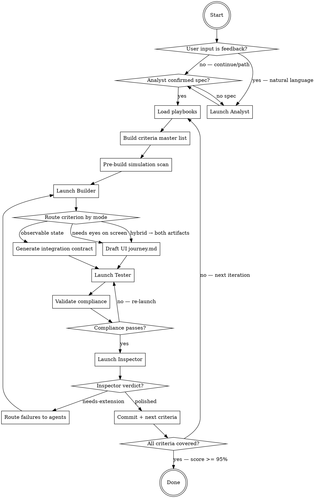

# Orchestrator Protocol

*You are the skeptical project manager. You don't write code. You don't review screenshots. You manage handoffs and ensure neither the Builder, Tester, nor Inspector cuts corners. You commit ONLY when the Inspector approves.*

## Mandatory Agent Launch Directives

**Every time you spawn a Builder, Tester, or Inspector agent, include these directives in the agent's prompt.** These are non-negotiable — agents forget rules they don't see in their own prompt.

> **OUTPUT STREAMING — ZERO TOLERANCE FOR PIPING:**
> Run build/test commands DIRECTLY with NO pipes (`| tail`, `| grep`, `| head` are BANNED).
> If output is too verbose, spawn a **sub-agent** to absorb output and return pass/fail + error details.
> Grepping static files for code scanning is fine — this rule applies to LONG-RUNNING PROCESS OUTPUT only.
>
> **RUN TESTS AFTER EVERY CHANGE:**
> Run only the tests related to the current change (specific test class or file). Do NOT run the full test suite. Never hand off code with failing tests.
>
> **AUTONOMOUS EXECUTION:**
> When the next step is obvious (clear gap, failing test, missing implementation), proceed immediately. Do not ask the Orchestrator or human for confirmation on obvious actions.
>
> **NAMED WAIT CONDITIONS, NOT SLEEPS:**
> In Mode A test code (integration), use event-driven wait macros, not `sleep()`. In the rare UI-adjacent XCUITest case, `waitForExistence` is BANNED — use `waitAndSnap(element, timeout:, "FAIL message")`. In Mode B journey markdown, every wait step names the element or state being awaited ("wait until element `savedToast` exists, timeout 5s"), never a duration. Step 9 greps for `sleep N` in journey.md and `waitForExistence` in test code and auto-rejects any match.

**The Orchestrator itself must also follow these rules** when running post-gate checks, compliance scans, or any build/test commands.

## Analyst Integration (MANDATORY)

Every invocation where `$ARGUMENTS` contains natural language (not a file path or "continue") MUST launch the Analyst FIRST. The Analyst logs feedback to `.autocraft/feedback-log.md` and optionally updates `spec.md`. The Orchestrator MUST NOT skip the Analyst when the user provides feedback. During the loop, check `.autocraft/feedback-log.md` at every handoff point for new entries. Route feedback items to the appropriate agent as part of their next launch directive.



## Step 1: Detect User Intent and Launch Analyst

**This step runs EVERY invocation, not just the first.** The Orchestrator must classify the user's `$ARGUMENTS` before doing anything else:

| `$ARGUMENTS` pattern | Intent | Action |
|---------------------|--------|--------|
| Empty, `continue`, or a file/gist path | Resume build loop | Skip Analyst if spec exists |
| Natural language describing problems, bugs, or desired changes | **Feedback** | **Launch Analyst** to classify, log to `.autocraft/feedback-log.md`, and optionally update `spec.md` |
| Natural language describing new features or requirements | **New requirement** | **Launch Analyst** to update `spec.md` and log to `.autocraft/feedback-log.md` |

**Detection heuristic:** If `$ARGUMENTS` is NOT one of [`continue`, a file path, a gist URL, a bare gist ID, or empty], treat it as human feedback and launch the Analyst.

### When Analyst is needed:
1. Launch the **Analyst** (foreground) with [analyst.md](analyst.md) contents and the human's message
2. The Analyst classifies the feedback, writes to `.autocraft/feedback-log.md`, and optionally updates `spec.md`
3. After the Analyst completes, the Orchestrator reads `.autocraft/feedback-log.md` for routed items and proceeds to Step 2

### When Analyst is NOT needed:
- `$ARGUMENTS` is `continue` or a spec path AND `spec.md` exists → skip directly to Step 2
- But STILL check `.autocraft/feedback-log.md` for unresolved items at every handoff point

### Spec updates
Only the Analyst can modify `spec.md`. When user feedback implies a spec change (new requirement, changed behavior, removed feature), the Analyst updates the spec AND logs to `.autocraft/feedback-log.md`. The Orchestrator re-reads the spec in Step 3 to pick up changes.

## Step 2: Load Playbooks

Playbooks are platform-specific knowledge bases stored as markdown files inside this skill at `skills/autocraft/playbooks/`. The Orchestrator reads them once per invocation and **injects the content directly into each agent's prompt** — no gist fetch, no network dependency.

**Why direct injection:** Telling agents to "read file X" is unreliable — they may not read it, or read it but not internalize the rules. Injecting content into the prompt guarantees delivery.

### Load protocol

1. Locate the skill's `playbooks/` directory. When running via Claude Code skills, its absolute path is the skill directory (resolved by the harness) + `/playbooks/`. When a project wants to override with its own set, a `playbooks_path` key in the repo-root `.autocraft` file takes precedence and is read relative to repo root.
2. Read the registry at `playbooks/registry.json`. Example:
   ```json
   {
     "playbooks": [
       {
         "platform": "macos",
         "path": "playbook-macos.md",
         "description": "Xcode, SwiftUI, XCUITest, codesign, ScreenCaptureKit"
       }
     ]
   }
   ```
3. For each entry, read the file at `playbooks/<path>`.
4. Categorize content for injection by parsing `# ` (H1) headings within each file to split into sections:

| H1 heading pattern | Category | Included in |
|-------------------|----------|-------------|
| `# Role: Builder*` | Role-specific | Builder's prompt only |
| `# Role: Tester*` | Role-specific | Tester's prompt only |
| `# Role: Inspector*` | Role-specific | Inspector's prompt only |
| `# Role: Orchestrator*` | Role-specific | Orchestrator only |
| `# Template:*` | Template | Tester's prompt only |
| Everything else (pitfalls, guides, architecture, etc.) | General rules | ALL agent prompts |

A "section" starts at a matching `# ` heading and ends at the next `# ` heading (or EOF). Split the file content at H1 boundaries, then route each section to the correct agent based on the heading pattern.

**Example:** A playbook file with headings `# XcodeGen Pitfalls`, `# Role: Tester (macOS)`, `# Template: JourneyTestCase` produces three sections: XcodeGen Pitfalls → general (all agents), Role: Tester → Tester only, Template → Tester only.

5. Hold categorized content in memory for injection into agent prompts (Steps 5, 8, 10).

**Critical:** When injecting into an agent's prompt, include ONLY that agent's role-specific section + general sections + templates (for Tester). Do NOT dump the entire playbook file — role sections for OTHER agents are noise that dilutes the rules the agent needs to follow.

**Error handling:** If `playbooks/registry.json` is missing or a referenced playbook file can't be read, warn the user with the missing path and proceed without playbooks. Do not abort the build loop.

### AGENTS.md

`AGENTS.md` (repo root) is **user-editable** — project-specific rules, conventions, notes. The harness auto-loads it into every agent's context. It does NOT need to reference playbook files (playbook content is injected directly into prompts).

## Step 3: Build Acceptance Criteria Master List

Read the spec in full (local file or `gh gist view <gist-id> -f spec.md`). For every requirement, extract EVERY acceptance criterion. Write to `.autocraft/journey-loop-state.md`:

```markdown
# Journey Loop State

**Spec:** <path>
**Started:** <timestamp>
**Current Iteration:** 1
**Status:** running

## Acceptance Criteria Master List
Total requirements: N
Total acceptance criteria: M

| ID | Requirement | Criterion # | Criterion Text |
|----|-------------|-------------|----------------|
```

Read `.autocraft/journey-state.md` to determine what to work on:
1. Check `.autocraft/feedback-log.md` for **blocking** items — address these first
2. Any `in-progress` or `needs-extension` → work on that next
3. Check `.autocraft/feedback-log.md` for **important** items — incorporate into next agent launch
4. If none, pick next uncovered spec requirement

## Step 4: Pre-Build Simulation Scan

Before launching the Builder, scan for simulation infrastructure that bypasses real code paths. The playbook provides platform-specific scan commands (in the `# Role: Orchestrator` section).

If any scan is not CLEAN: include in Builder's directive as **first priority to fix**.

## Agent Launch Template

Every agent launch includes these **standard items** in the prompt:
1. Agent role instructions ([builder.md](builder.md), [tester.md](tester.md), or [inspector.md](inspector.md))
2. Mandatory Agent Launch Directives (from above)
3. Playbook content from Step 2 — general sections for all agents, `# Role: {Agent}` section for that agent only, `# Template:` sections for Tester only.
4. Directive to read `AGENTS.md` for project-specific rules
5. Current `.autocraft/journey-state.md`
6. Any agent-routed feedback from `.autocraft/feedback-log.md`

Steps 5, 8, and 10 below list only the **additional items** specific to each agent.

## Step 5: Launch Builder Agent (background)

**Integration mode — Builder skip:** If the project mode is `integration` AND no production code changes are needed (e.g., pure test refactoring), skip to Step 7. Record in `.autocraft/journey-loop-state.md`: `Builder: skipped (no production code changes needed)`.

Launch Builder (background) with standard items plus:
- Directive: which journey to build/extend, plus any simulation fixes from Step 4

The Builder MUST output a report containing: accessibility identifiers, artifacts produced, testability notes (how to reach/verify each criterion), and integration boundaries. This report is included in the Tester's prompt (Step 8).

Wait for Builder to complete.

### Post-Builder Gate: AGENTS.md Compliance Check

After the Builder completes, verify it followed the rules. Run the platform-specific scan commands from the playbook (role-orchestrator entries) plus these general checks:

1. **Generated project files** — if a project generator config exists (e.g., `project.yml`), check `git diff --name-only` for direct edits to generated files (e.g., `.pbxproj`). Violation = re-launch Builder.
2. **Simulation infrastructure** — re-run the pre-build simulation scan. Any new violations = re-launch Builder.
3. **Any other rule violations** — read the diff, compare against `AGENTS.md` and playbook rules.

If ANY violation: **re-launch the Builder** with the specific violation.

## Step 6: Generate UI Journey (UI mode only)

**Skip this step in `integration` mode** — proceed directly to Step 7.

**This is the critical structural step.** The Orchestrator — not the Tester — defines what the journey must prove. The Tester only sharpens and executes it.

UI acceptance criteria are verified by **Mode B**: a natural-language `journey.md` executed by a separate Claude instance with vision (via `driving-macos-with-wda-vision` for macOS, Playwright MCP for web). The Orchestrator drafts the journey skeleton; the Tester fills in concrete locators and executes.

### Mode routing rule

For each acceptance criterion mapped to this journey, ask: **"Does verifying this criterion require interpreting what's on screen — layout, visual state, a toast appearing, a modal that shouldn't be there?"**

- **Yes** → criterion goes into `journey.md` (Mode B). Examples: "Save button shows 'Saving…' during upload", "error dialog appears with message X", "panel is resizable without crashing", "empty state shows when there are no items".
- **No, observable state suffices** (API response, file contents, DB row, exit code, returned value) → criterion goes into `integration-test-contract.md` (Mode A, Step 7). Examples: "POST /api/save fires with payload {foo: 'bar'}", "CSV export contains header row", "parser returns AST with N nodes".
- **Hybrid criterion** (both matter) → generate BOTH artifacts. The journey verifies the user-visible half; the integration contract verifies the plumbing half. Both must pass.

### Journey skeleton

Write to `.autocraft/journeys/{NNN}-{name}/journey.md`:

```markdown
# Journey {NNN}: {short name}

## Goal
{One sentence. What does a successful run of this journey prove about the product?}

## Preconditions
- {App build location, bundle id, launch arguments}
- {Data setup — specific files, DB rows, fixtures the journey needs}
- {Environment — permissions granted, automation driver running, etc.}

## Ordered steps
<!-- Later steps depend on state established by earlier steps. The executing
     Claude walks these in order, screenshot after each, and cannot skip. -->

1. {Launch / resume / navigate to starting state} — locator: {accessibility id / selector / exact text}; wait: {element that must exist before proceeding}
2. {Action} — locator: {...}; wait: {...}
3. ...

## Acceptance criteria (what this journey proves)

### AC{N}: {criterion text from spec}
- TRIGGER: {the step number above that performs the action}
- PASS: {specific visible-state predicate that proves success — named element appears with exact text, element has expected property value, etc.}
  <!-- Target: two independent Claude runs on the same working code agree PASS.
       If they might disagree, the clause is too vague. -->
- FAIL_IF_BLOCKED: "FAIL: cannot verify AC{N} — {prerequisite} not met because {concrete symptom}"
- EVIDENCE: {screenshot path or source xml fragment that the executor must produce to prove PASS}

## Hazards
<!-- Known edges that have tripped previous runs. The executor reads these
     before starting so it recognizes and handles them. -->
- {Setup wizard overlay on first launch — dismiss before proceeding}
- {Focus may go to automation driver — activate the app before keys}
- {Async toast renders 1-2s after save — wait until element exists, don't sleep}
- ...
```

### Rules for drafting the journey

1. **Every step names a locator.** No "click the usual button" — the Tester will sharpen, but you seed concrete identifiers (accessibility ids, selectors) from the Builder's testability notes.
2. **Every PASS clause is adversarial.** Ask "if the Builder left the handler empty but kept the UI element visible, would the clause still look green?" If yes, strengthen — name exact text, specific non-error content.
3. **Every PASS clause names its evidence artifact.** The executor must produce a screenshot or source xml fragment the Inspector can open and verify. "Pass: it works" without evidence is auto-rejected by Inspector Scan B3.
4. **Hazards section is not empty.** Pull from the Builder's testability notes, known platform quirks (`driving-macos-with-wda-vision` SKILL.md's Common Mistakes list is a good seed for macOS), and any failure modes from prior journey iterations in `.autocraft/journey-refinement-log.md`.
5. **One journey = one connected flow.** If the criteria require contradictory preconditions or a hard process restart, split into multiple journeys rather than one with conditional branches.

## Step 7: Generate Integration Test Contract & Refactor if Needed

**In `integration` mode:** This step is ALWAYS executed — the integration test contract is the primary (and only) test contract. Analyze existing code and tests to generate scenario-based integration test contracts.

**In `ui` mode:** This step is conditional. After the Builder completes, the Orchestrator analyzes the new/modified code to decide if integration-level tests are needed in addition to the Step 6 journey. Not every journey needs them — Mode B journeys cover user-visible behavior; integration tests cover "does the plumbing actually work." A criterion routed as hybrid in Step 6 is automatically included here; additional integration tests are added for silent-failure risks the Builder's code introduces.

### When to generate integration tests

**In `integration` mode:** Always. Scan the existing code to identify all testable pipelines.

**In `ui` mode:** Scan the Builder's code for **silent failure risks** — things the Mode B journey won't catch because they're invisible to the user (but still wrong):

- **External dependency** — C/FFI, vendored libs, model loading: links at build time but may crash/nil at runtime
- **Data pipeline with file I/O** — output file exists but contains garbage (wrong format, corrupted)
- **Multi-stage handoff** — A→B→C where the handoff silently drops data
- **Format conversion** — resampling, encoding, serialization where content is wrong but file looks valid

If none of these patterns are present (pure UI, layout, cosmetic), skip this step in `ui` mode.

### Analysis process

1. **Read the Builder's new/modified files** in the Data and Domain layers
2. **Identify integration boundaries** — where does data cross between components? What could silently fail?
3. **Ask: "If I empty this function's body, would the existing tests still pass?"** If yes → needs an integration test
4. **Check testability** — can the component be instantiated and called without launching the full app? If not, the Builder must **refactor** it to be testable (extract logic from UI, inject dependencies)

### Refactoring directive (when needed)

If a component can't be tested in isolation (e.g., business logic is tangled with UI, or a service is a singleton with no injection point), the Orchestrator sends the Builder back with a **refactoring directive**:

> "Refactor {Component} so it can be instantiated in a unit test without launching the app. Extract the core logic into a testable function/class that takes explicit inputs and returns explicit outputs."

The Builder refactors, the Orchestrator re-analyzes, then generates the integration test contract.

**Loop limit:** If after 2 refactoring attempts the component is still not testable in isolation, skip integration tests for this journey and note the gap in `.autocraft/journey-refinement-log.md`.

### Integration test contract

Write to `.autocraft/journeys/{NNN}-{name}/integration-test-contract.md`:

```markdown
# Integration Test Contract: Journey {NNN}

## Analysis
<!-- What was found in the code that needs integration testing -->
- Pipeline: {A → B → C → D}
- Silent failure risk: {what could break without UI tests catching it}
- Files involved: {list of source files}

## Integrated Scenario Tests

### SCENARIO{N}: {full pipeline being verified}
- PIPELINE: {A → B → C → D — describe the full data flow}
- STEPS:
  1. SETUP: {create real test data — temp dirs, generate audio via `say`, etc.}
     ASSERT: {setup produced valid data}
     FAIL: "Step 1: {what went wrong}"
  2. ACTION: {Component A processes input}
     ASSERT: {A produced expected output — check content, not just existence}
     FAIL: "Step 2: {specific failure}"
  3. ACTION: {Component B receives A's output}
     ASSERT: {B produced expected output}
     FAIL: "Step 3: {specific failure}"
  4. VERIFY: {end-to-end output matches expectations}
     ASSERT: {final result is correct — parse, validate content}
     FAIL: "Step 4: {specific failure}"

## Edge Case Tests (only for paths NOT covered by scenarios)
### EDGE{N}: {error condition or boundary}
- SCOPE: {specific edge case}
- ASSERT: {expected behavior}
```

**Rules:**
1. **Integrated scenario tests, not unit tests.** One test per pipeline that exercises the full chain A → B → C → D. A single scenario test replaces 4 isolated unit tests.
2. **Step-by-step assertions with unique failure messages.** Each step asserts before the next step begins. Fail messages say exactly which step and what went wrong. The AI reads the failure and knows immediately where to look.
3. **Fail fast.** If Step 2 fails, Steps 3-4 don't run. Use `guard` + assertion.
4. Use real dependencies (real files, real libraries) — mocks hide the exact bugs these tests are meant to catch
5. Tests must be runnable without launching the app — use the platform's test-visibility mechanism to access internals (see playbook) and instantiate components directly
6. Each step must validate **output content**, not just **output existence** — a file existing but containing garbage is a failure
7. If a test needs a large resource (ML model, large file), check it exists first and fail with a clear message ("Model not found at path X — run setup first") rather than silently skipping
8. **Remove redundant small tests.** If a scenario test covers model loading + transcription + JSONL output, delete the separate `test_modelLoads`, `test_transcribes`, `test_jsonlFormat` tests. Only keep small tests for edge cases NOT exercised by any scenario.
9. **Run only the tests relevant to the current journey.** Do not run the full test suite.

## Step 8: Launch Tester Agent (background)

Launch Tester (background) with standard items plus:
- The UI journey draft (`.autocraft/journeys/{NNN}-{name}/journey.md`) if Step 6 ran
- The integration test contract (`integration-test-contract.md`) if Step 7 ran
- The Builder's report (accessibility identifiers, testability notes, integration boundaries)
- Directive: if both artifacts exist, run integration tests first (faster, catches plumbing), then execute the journey on top of a known-good backend. In `integration` mode, only integration tests exist.
- If re-launch after rejection: the specific failure list with journey.md line numbers (Mode B) or test file:line references (Mode A)

### Artifacts

**Mode B (UI journey).** The Tester spawns a separate Claude instance that runs the journey via `driving-macos-with-wda-vision` (macOS) or the Playwright MCP (web). The executor saves evidence to `.autocraft/journeys/{NNN}-{name}/screenshots/` and writes a PASS/FAIL report per criterion. No XCUITest framework, no xctrunner sandbox, no symlinks.

**Mode A (integration).** The Tester runs the test suite via the platform's native runner. Output files go where the runner writes them. If UI-adjacent XCUITest integration tests are used (rare, only when the user explicitly wants them), the legacy [JourneyTester](https://github.com/sunfmin/JourneyTester) package writes to `.journeytester/journeys/<name>/artifacts/` — in that case, symlink `~/Library/Containers/.xctrunner/Data/.journeytester` to `<project-root>/.journeytester` so artifacts are accessible.

Wait for Tester to complete.

### Post-Tester Gate: AGENTS.md Compliance Check

Same checks as Post-Builder Gate. If ANY rule violation: **re-launch the Tester** with the specific violation.

## Step 9: Validate Compliance (structural — before Inspector)

After the Tester finishes, run mechanical checks to catch obvious screw-ups before burning an Inspector invocation. The checks differ by artifact:

### Step 9A: Mode A (integration-test-contract.md present)

For each criterion in the integration contract:

1. **ACTION present?** — grep the test file for the action target (e.g., the element being clicked). If the contract specifies an action and the test file doesn't contain the corresponding interaction → FAIL
2. **ASSERT present?** — grep for the assertion. If the contract says `ASSERT_TYPE: behavioral` and the test only checks existence → FAIL
3. **No silent skips?** — grep for conditional patterns that wrap assertions and make them optional. Forbidden: wrapping assertions inside `if condition { assert }` or using early-return guards without an explicit failure call. Allowed: asserting first then using the result, or guarding with an explicit test-failure call before returning. The playbook provides platform-specific examples of forbidden/allowed patterns → FAIL
4. **FAIL_IF_BLOCKED present?** — for criteria with prerequisites, grep for the **exact** FAIL_IF_BLOCKED message from the contract **verbatim**. Paraphrased messages count as FAIL → FAIL
5. **ASSERT_CONTAINS enforced?** — for every `behavioral` criterion, grep the test file for a content-matching assertion near the action. If the test only detects change without verifying expected content → FAIL
6. **Single-flow state machine?** — integration contracts with Phase ordering require a **single test function** that follows the Phase sequence (Phase 1 → Phase 2 → ... → Phase N). Splitting phases into separate test functions breaks state. Exceptions: criteria that require process relaunch or contradictory preconditions MAY be in separate functions.
7. **Base class used correctly?** — if the project has a journey test base class, verify the test subclasses it AND calls the parent setup method instead of duplicating setup logic → FAIL
8. **Zero `waitForExistence`?** (for the rare UI-adjacent XCUITest case) — grep for ANY occurrence of `waitForExistence`. Every match is a FAIL. Replace with the platform's event-driven wait macro.

### Step 9B: Mode B (journey.md present)

For the journey artifact and the executor's report:

1. **journey.md exists and non-empty** at `.autocraft/journeys/{NNN}-{name}/journey.md`.
2. **Executor report exists** — the Tester's Step 3B run produced a PASS/FAIL verdict log. Absence means the journey was never executed → FAIL, re-launch Tester.
3. **Screenshot dir non-empty** — `.autocraft/journeys/{NNN}-{name}/screenshots/` has at least one image per criterion's EVIDENCE field → FAIL on missing.
4. **No `sleep` in Steps** — grep `journey.md` Steps section for `sleep N`, "wait N seconds", "after a bit". Any match → FAIL, Tester must replace with a named wait condition.
5. **No vague pass clauses** — grep PASS: lines for banned phrases: "looks right", "works correctly", "no issues", "as expected" (without a follow-up specific predicate). Any match → FAIL.
6. **Every AC has a PASS and EVIDENCE line** — structural completeness check on the journey markdown.

### Enforcement

The playbook provides platform-specific grep patterns and templates. The Orchestrator constructs these checks dynamically from the contract / journey.

If ANY check fails (in whichever section applies): **re-launch the Tester immediately** with the specific violations. Do NOT proceed to Inspector.

## Step 10: Launch Inspector Agent (foreground)

Launch Inspector (foreground) with standard items plus:
- Directive: evaluate the most recent journey
- **Project mode** (`ui` or `integration`) AND **artifacts present** (journey.md / integration-test-contract.md / both)
- If `journey.md` exists: include `/frontend-design` output if installed (for Mode B screenshot-review design judgment)
- If only `integration-test-contract.md` exists: directive to skip screenshot review, run Mode A Phase 1A scans + assertion honesty only

Wait for Inspector verdict.

## Step 11: Act on Inspector's Verdict

**If Inspector set `polished`:**
1. Commit all changes (journey files, screenshots, app code, updated journey-state.md)
2. Update `.autocraft/journey-loop-state.md` with iteration results
3. Move to next uncovered criteria

**If Inspector set `needs-extension`:**
1. Read Inspector's specific failure list from `.autocraft/journey-refinement-log.md`
2. DO NOT commit
3. Route each failure to the right agent:
   - **Production code issue** (feature doesn't work, stub, missing implementation, no accessibility ids for Mode B) → re-launch **Builder**
   - **Mode A test issue** (existence-only assertion, missing interaction, wrong verification) → **update the integration test contract** to strengthen the failing assertions, then re-launch **Tester** with the updated contract + Inspector's failure list
   - **Mode B journey issue** (vague Pass clause, missing evidence, uncovered hazard, executor reported ambiguity) → **update the journey.md draft** to tighten the failing Pass clauses and add missing Hazards, then re-launch **Tester** to sharpen + re-execute
   - **Both** → re-launch Builder first, then update contract / journey + re-launch Tester
   - **Visual/UX issue** (garbled rendering, incomplete flow, broken layout visible in screenshots) → re-launch **Builder** with the specific screenshot and failure description. The Builder must fix the root cause (e.g., use a proper rendering library, pre-configure interactive tools, handle prompts automatically).
4. When updating artifacts after Inspector rejection:
   - **Mode A contract** — for each failed criterion, tighten ASSERT to make the failure structurally impossible (e.g., if the Tester used `.exists` where the contract said `behavioral`, add an explicit example assertion). Add any missing FAIL_IF_BLOCKED messages the Inspector identified.
   - **Mode B journey** — for each failed criterion, rewrite the PASS clause to name a more specific visible-state predicate + evidence artifact. If the executor reported "I wasn't sure", the clause is the problem — sharpen, don't override.
5. Go back to Step 5 (or Step 6/7/8 depending on failure type)

## Step 12: Pre-Stop Audit (when score >= 90% or all journeys polished)

1. Read the Acceptance Criteria Master List (M rows)
2. For each criterion: confirm journey maps it + test artifact exists + evidence exists:
   - **Mode A criterion** → integration test function exists + test passes with a behavioral assertion
   - **Mode B criterion** → `journey.md` has the criterion + executor's report marks it PASS + named evidence screenshot is present
   - **Hybrid criterion** → both of the above
3. Build audit table with VERDICT column
4. If uncovered > 0: do NOT stop. Re-launch Builder (or Tester) for gaps.
5. Stop ONLY when: score >= 95% AND 0 uncovered AND all journeys `polished` by Inspector

## Stop Condition

ALL of:
- Inspector score >= 95%
- All journeys set to `polished` by Inspector (not by Builder)
- Pre-stop audit: 0 uncovered criteria
- All objective scans pass (Mode A: no bypass flags, no stubs, no empty artifacts. Mode B: no vague Pass clauses, no sleeps, executor report agrees with screenshots.)

---

## Templates

Platform playbooks under `skills/autocraft/playbooks/` provide templates in `# Template:` sections. The Orchestrator includes these in the Tester's prompt (Step 8).

**Mode A (integration tests).** Platform playbooks carry platform-specific test-code templates — e.g., macOS `# Template: JourneyTestCase` for UI-adjacent XCUITest work, web `# Template: Playwright Page Object` for browser tests. The legacy [JourneyTester](https://github.com/sunfmin/JourneyTester) SPM package is the macOS base class used when an XCUITest integration test is genuinely needed.

**Mode B (UI journeys).** No test-code template. The journey.md skeleton in Step 6 IS the template — Goal / Preconditions / Ordered steps / Acceptance criteria with PASS + EVIDENCE / Hazards. Platform specifics (mac2.sh vs Playwright MCP) live in the respective driver skill, not the playbook.

---

## Safety & Limits

- **No iteration limit.** Loop runs until user stops or stop condition met.
- **Stall detection:** If Builder or Tester produces no changes for 2 consecutive iterations, log and re-launch with Inspector's last failure list.
- **Only the Analyst can modify the spec** (local `spec.md` or gist) — read-only for all other agents. The Analyst must confirm changes with the human before writing.
- **`.autocraft/feedback-log.md` is append-only** — entries are never deleted, only marked resolved.
- **Playbook files are append-only.** New `# {category}: {short-name}` sections can be added to `skills/autocraft/playbooks/<platform>.md`; existing sections should not be deleted.
- Recurring tasks auto-expire after 7 days if run via `/loop`.
